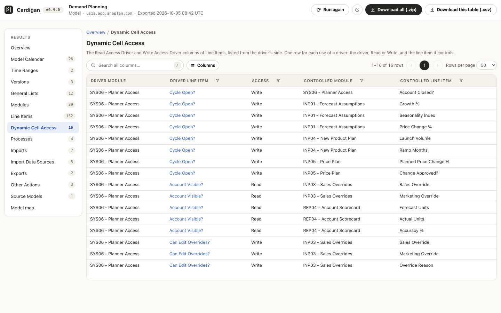
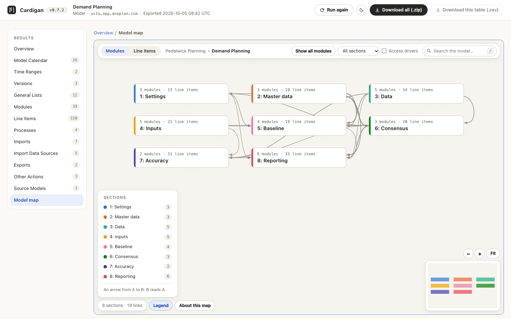
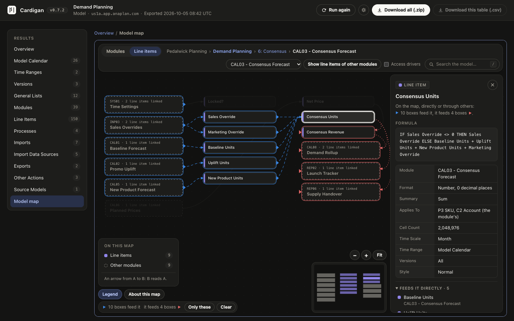

# Cardigan

Cardigan is a Chrome extension for Anaplan. Open an app or a model, click the Cardigan icon, and it reads what the app's pages or the model's settings hold. The result opens on a page of its own, where you can search, sort and filter each table. For a model, the page also draws a map of what feeds what.

Cardigan makes no file and offers no download: the results page is the only place to see a result. The last result is kept for its tab in the browser's session storage, so that a refresh brings it back.

Cardigan only reads, with your own signed-in session, and nothing it reads leaves your browser. It is an independent project, not affiliated with Anaplan: see [NOTICE.md](NOTICE.md).

The pictures on this page show an invented app and model. They leave out the bar at the top of the page.

## What you get

### For an app

Cardigan reads every published page of the app. The **Overview** counts each table's rows and says what was read and when. The tables:

| Table | One row per |
| --- | --- |
| **Pages** | Page: category, type, publish state, model and card counts |
| **Cards** | Card: type, modules, saved view, line items shown, rows, columns, context selectors, filters, formatting, buttons and text |
| **Grid Sections** | Section of a grid or chart; a combined grid has several |
| **Filters** | Filter condition on a grid's rows or columns |
| **Conditional Formatting** | Formatting rule or KPI indicator |
| **Action Buttons** | Button, with its action type and the model action it runs |
| **Where Used** | Use of a module, line item, dimension, saved view, action or linked page by a card |

**Where Used** opens **By object**: one row per object, with how many pages and cards use it and as what. A row opens the object with each of its uses. **Every use** lists the uses one by one.

### For a model

Open the model in Model Building; the classic model page opened on its own works too. Cardigan reads the Model settings into twelve tables, in Anaplan's order, and makes a thirteenth, Dynamic Cell Access, from Line Items: Model Calendar, Time Ranges, Versions, General Lists, Modules, Line Items, Dynamic Cell Access, Processes, Imports, Import Data Sources, Exports, Other Actions and Source Models.

- A table read from a Model settings grid is laid out as Anaplan's own export of that grid: each row's name first, then the grid's columns.
- **Line Items** covers every module and lists each line item beside its module; a module's own row is not listed. Three columns follow Anaplan's own: **Ratio Numerator**, **Ratio Denominator** and **Format List**.
- **Dynamic Cell Access** lists each access driver with the line items it controls, one row per use, marked **Read** or **Write**. It is made from the **Read Access Driver** and **Write Access Driver** columns of Line Items, which name a driver only on the line item it controls.
- The page says a format, a summary or an action's definition in words, such as "Number, 2 decimal places" or "List: Products". Click the row to see the definition as it was read, under **Format as read**, **Summary as read** or **Action as read**.
- **Processes**, **Exports** and **Other Actions** are the Actions list, split at its headings. **Imports** joins each import's source and target with its last run, notes and processes.
- **Model Calendar** follows an assessment template. The template's rows about the model itself are not listed: those that have a value, such as **Captured on**, are on the Overview, under **About this export**.

#### Model map

**Model map**, the last entry in a model's navigation, draws the model: its sections, modules and line items, and what feeds what. It is made from the tables above and nothing else, so it reads nothing more from Anaplan.

- The map opens on the model's sections. A section is the modules under one heading: a module whose name starts with `--`, such as `-- Inputs --`. Without headings it opens on the modules.
- Double-click a section to open its modules, and a module to open its line items. **Show all modules** shows every module. `Esc` goes back a step.
- An arrow from A to B means B reads A.
- Click a box to see everything that feeds it, marked in blue, and everything it feeds, marked in red, directly or through others. The rest fades; **Only these** hides it.
- The panel on the right gives the box's details: for a line item its formula, format and summary in words, and what feeds it and what it feeds directly.
- The search finds sections, modules and line items by name. In the **Legend**, click an entry to hide or show its boxes. **Access drivers** adds a link from each access driver to what it controls.
- Drag to move, scroll to zoom, press `F` for the whole map. **About this map** lists the keys. The map follows the page's theme.

## Install

Cardigan needs Chrome 111 or later, on Windows or on a Mac. Nothing else has to be installed.

1. **Download the extension.** On the [latest release](https://github.com/larasrinath/cardigan/releases/latest), under **Assets**, take `cardigan-<version>.zip`: the entry that shows a file size. Do not take **Source code (zip)** or **Source code (tar.gz)**. GitHub adds those two to every release, the zip one even arrives under the same file name, and they hold the source code, which Chrome cannot load.
2. **Unzip it into a folder you keep.** Chrome loads the extension from that folder every time it starts. On Windows, right-click the zip and choose **Extract All...**; on a Mac, double-click it.
3. **Look into the folder.** It must hold `manifest.json` and a `dist` folder with four `.js` files. If it holds `src` and `package.json` instead, it is the source code: go back to step 1.
4. **Load it in Chrome.** Open `chrome://extensions`, turn on **Developer mode** at the top right, choose **Load unpacked** and select that folder.
5. **Refresh your Anaplan tabs.** A tab that was open before needs one refresh. Then click the Cardigan icon; the puzzle icon in Chrome's toolbar lets you pin it there.

If Chrome says **Could not load javascript 'dist/content.js' for script** and **Could not load manifest**, the folder you selected has no `dist` folder: it is the source code, or a folder above or below the right one. Start again from step 1.

To check the download, compare it with the SHA-256 published with the release: `shasum -a 256 cardigan-<version>.zip` on a Mac, `certutil -hashfile cardigan-<version>.zip SHA256` on Windows.

To update, unzip the new release over the same folder, click the reload icon on Cardigan's card in `chrome://extensions`, then refresh your Anaplan tabs.

## Use

1. Sign in to Anaplan. Open an app, or open a model in Model Building and wait until it has loaded.
2. Click the Cardigan icon in Chrome's toolbar. The results page opens in the next tab and starts reading by itself.
3. Keep the Anaplan tab open until it finishes. The page shows each step, then the result.

Closing the results page stops the reading.

### The results page

- The page is as wide as the window: the navigation stands at the left, and the table or the map takes the rest.
- The search box looks in every column, shown or hidden. Press `/` to reach it.
- Click a column's name to sort. A column with 2 to 30 different values also has a filter.
- **Columns** picks the columns shown. An app's ID columns, **Card #** and **Section #** start hidden.
- Click a row to read every value in full. In an app, a page's name shows that page's cards, and a card's title opens the card with its grid sections, filters, formatting and buttons.
- Click an ID to copy it.
- The sun or moon button switches the theme.
- The page uses the window's whole width. The button beside the Cardigan name hides the navigation, so that a table or the model map takes all of it, and brings it back; your browser remembers the choice.

**How to read these tables**, on the Overview, has the notes for reading them. One to know: "(not in the model)" after an ID marks a module or line item that a card points at and the model no longer has, or that you cannot see.

### Run again, refresh and Forget this result

- **Run again** reads the Anaplan tab again. The result on the page stays until the new one is complete.
- The last finished result is kept for its tab, so a refresh brings it back without reading Anaplan. A line above it says when it was analysed.
- **Forget this result**, on the Overview, removes the kept copy at once. The result stays on the page until you refresh or close it.
- Only the icon starts a reading unasked. A results page that is reloaded, duplicated or reopened waits for **Run** or **Run again**.

### If it does not start

- **Not connected**: refresh the Anaplan tab, then click the icon again. A tab that was open before Cardigan was installed, updated or reloaded needs this once.
- **Nothing to analyse**: the tab shows an Anaplan page that is neither an app nor a model. Open one there, let it load, then choose **Run again**.
- When a reading stops, the page says what happened and what to do. **Copy diagnostic log** copies the log, to send with a report. It holds request paths, statuses and counts, and no cookies, tokens or cell values.
- If the model map cannot be drawn, the page says so in the map's place. The tables are not affected, and **Copy diagnostic log** beside the message copies the reason.

## Privacy and permissions

- Cardigan declares no permissions. Its scripts run only on `https://*.app.anaplan.com` and, for Australia, `https://*.app2.anaplan.com`, and add nothing to those pages.
- It reads nothing until you click its icon or choose **Run again**. It is read-only by construction: its web requests are GET requests to two Anaplan services, its socket client can only subscribe, and every request to a model is checked to carry no change.
- Nothing is sent anywhere except those reads, and the results page loads nothing from the internet.
- The kept result is in the browser's session storage for its tab, compressed and not encrypted.

[NOTICE.md](NOTICE.md) says the rest, including what closing a tab does and does not erase.

## Limits

- Only the published version of a page is read. A page never published is listed as "Not published".
- Reading an app's names can make Anaplan load its model, as opening one of its pages would.
- A saved view's own filters, sorts and hidden items are set in the model and are not listed.
- A card's shown or hidden items are named up to five per dimension, then counted. A text card's text is cut at 500 characters.
- A filter rule's line item in a module that no card shows is looked for during at most 45 seconds per model. After that the rule keeps its IDs, and a note says so.
- The items a filter rule names are looked up for at most 30 seconds per model. The rest keep their IDs.
- A button whose import, export or process is not in the model keeps its card label; **Name source** says so.
- Where two pages share a name, a count in **Where Used** can read "2+" (at least 2), and some links are plain text.
- A Model settings grid of more than 250,000 rows is not read. The Overview lists it under **Tables** as "Not exported", with the reason.
- In **Dynamic Cell Access**, a driver that cannot be matched to a line item is listed last, as Line Items has it and with no **Driver Module**, and the page says how many there are. The table is not made when Line Items was not read.
- The model map takes each link from a column that names another object, such as **Referenced By**. It shows formulas as text and does not work them out.
- The map draws sections, modules, line items and the lists that formulas name. Processes and actions are not drawn; a module's details name the imports that load into it.
- **About this map**, at the foot of the map, says what the map leaves out and could not place for this model, such as a line item named twice in one module.
- A large view is shown whole with names cut short: point at a box to read its name. One too large even for that opens on its start, and **Whole map** shows all of it.
- The map's view is not kept: a refresh, **Run again** or **Forget this result** starts it afresh.
- A result over 64 MB as JSON, or 9 MB compressed, is not kept for a refresh; the page says so.
- Anaplan can change the internal services Cardigan reads without notice: see [NOTICE.md](NOTICE.md).

## For developers

You need Node 20.19+, 22.12+ or 24+.

| Command | What it does |
| --- | --- |
| `npm ci` | Installs the pinned TypeScript, Vitest and esbuild |
| `npm run build` | Type-checks, then writes the four bundles in `dist/` |
| `npm test` | Runs the unit tests in `src/` (Vitest). `npm run test:scripts` runs those of `scripts/` |
| `npm run check` | Type-check, both test suites and the build. GitHub Actions runs it on every push and pull request |
| `npm run package` | Builds, then writes the release zip |
| `npm run icons` | Makes the four icons in `icons/` again from the logo, `icons/source.png` |

To run from source, choose **Load unpacked** and select the repository root. After a rebuild, reload the extension and refresh the Anaplan tab. `dist/` is not in Git: build after every pull.

In the Anaplan tab, `src/content.ts` and `src/analyse.ts` read an app, and `src/model-content.ts` and `src/model/` read a model through the page's own client. `src/card-reader/` reads a page's cards. `src/background.ts` opens the results page: `results.html`, `results.css` and `src/results/`. `src/map/` builds a model's map from the model's tables and draws it on the page, styled by `map.css`. `src/protocol.ts` lists the messages between the page and the tab.

### Release

1. Set the new `version` in `manifest.json`, `package.json` and `package-lock.json` (two fields), and add the release to [CHANGELOG.md](CHANGELOG.md).
2. Run `npm run check`.
3. Run `npm run package`. It writes `release/cardigan-<version>.zip` and prints its SHA-256.
4. Publish the zip with its SHA-256.

The zip holds the twelve files Chrome loads: `manifest.json`, four bundles, four icons, `results.html`, `results.css` and `map.css`. The same files always give the same bytes. The packager refuses a version that differs between `manifest.json` and `package.json`, a missing or stale bundle, a results page that loads a file outside the zip, and a manifest that asks for a permission or has no content security policy that keeps everything inside the package.

## Licence

[MIT](LICENSE).
