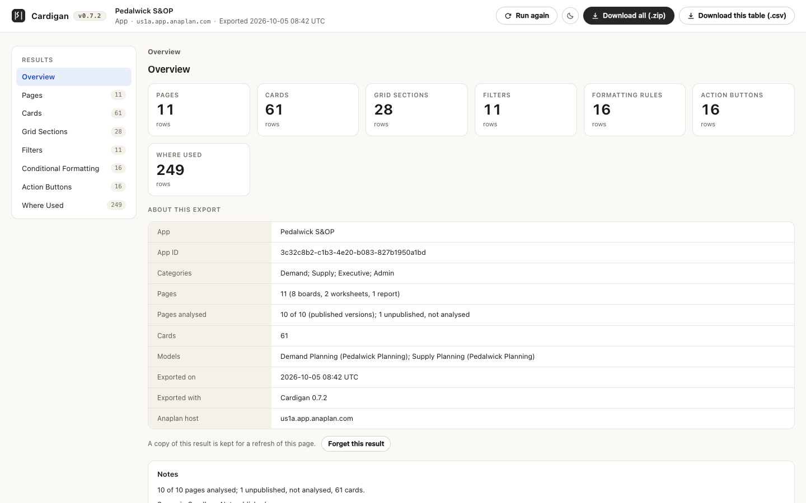
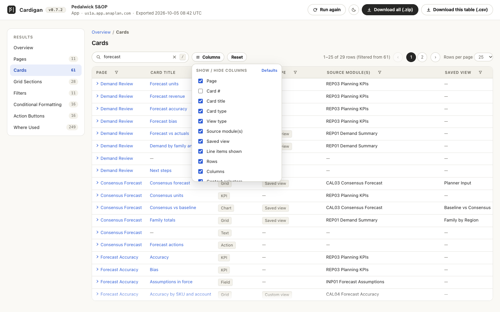
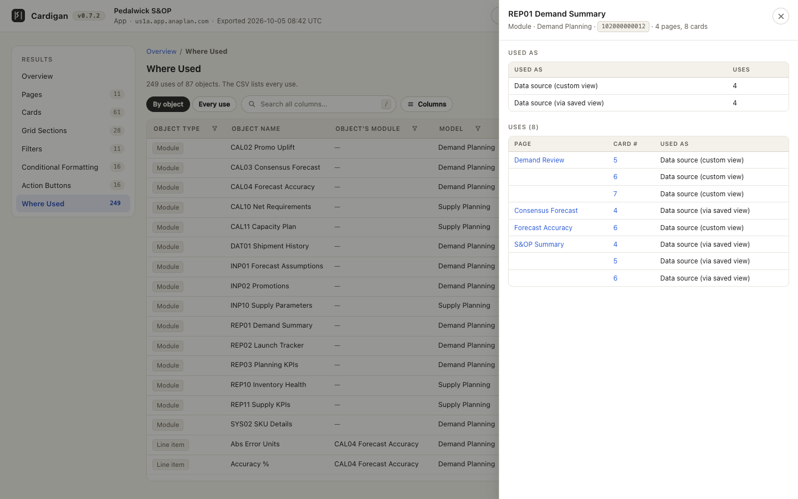
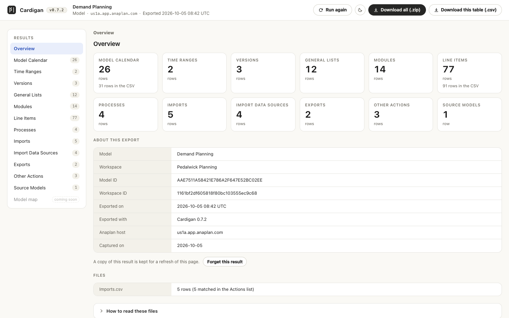
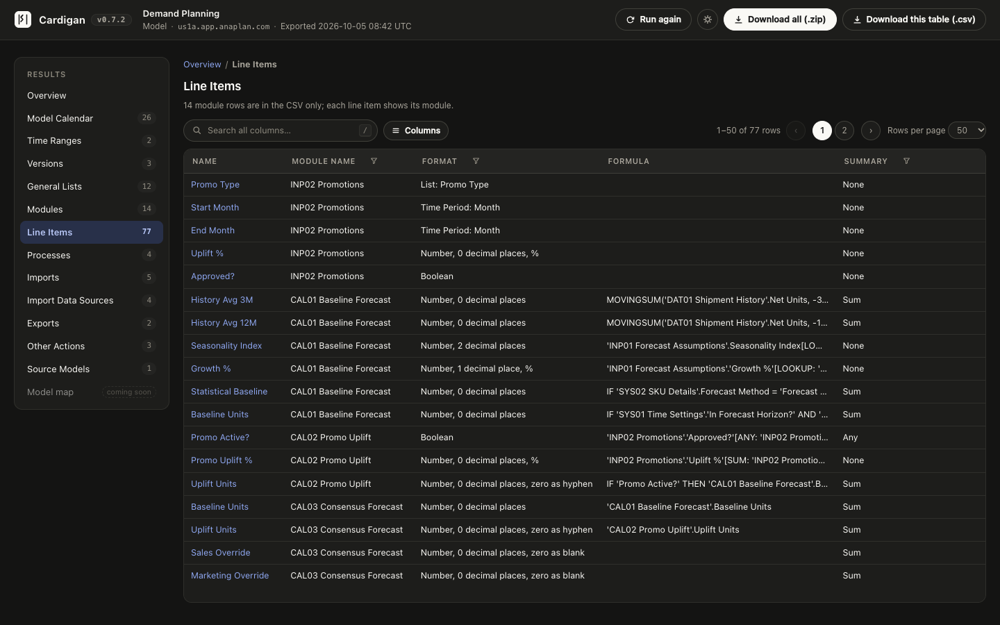

# Cardigan

Cardigan is a Chrome extension for Anaplan. Open an app or a model, click the Cardigan icon, and it reads what the app's pages or the model's settings hold. The result opens on a page of its own, where you can search, sort and filter each table and download it as CSV.

Cardigan only reads, with your own signed-in session, and nothing it reads leaves your browser. It is an independent project, not affiliated with Anaplan: see [NOTICE.md](NOTICE.md).

The pictures on this page show an invented app and model.

## What you get

### For an app

Cardigan reads every published page of the app. The **Overview** counts each table's rows and gives the details of the export. The tables:

| Table | One row per |
| --- | --- |
| **Pages** | Page: category, type, publish state, model and card counts |
| **Cards** | Card: type, modules, saved view, line items shown, rows, columns, context selectors, filters, formatting, buttons and text |
| **Grid Sections** | Section of a grid or chart; a combined grid has several |
| **Filters** | Filter condition on a grid's rows or columns |
| **Conditional Formatting** | Formatting rule or KPI indicator |
| **Action Buttons** | Button, with its action type and the model action it runs |
| **Where Used** | Use of a module, line item, dimension, saved view, action or linked page by a card |

**Where Used** opens **By object**: one row per object, with how many pages and cards use it and as what. A row opens the object with each of its uses. **Every use** lists the uses one by one.

<table>
  <tr>
    <td width="50%" valign="top">
       
      Cards, with search and the column chooser.
    </td>
    <td width="50%" valign="top">
       
      Where Used by object, with one module opened.
    </td>
  </tr>
</table>

### For a model

Open the model in Model Building; the classic model page opened on its own works too. Cardigan reads the Model settings into twelve tables, in Anaplan's order: Model Calendar, Time Ranges, Versions, General Lists, Modules, Line Items, Processes, Imports, Import Data Sources, Exports, Other Actions and Source Models.

- Each grid's CSV file is laid out as Anaplan's own export of that grid, with formats and summaries as JSON.
- **Line Items** covers every module, and its file adds three columns: **Ratio Numerator**, **Ratio Denominator** and **Format List**. The page lists each line item beside its module; module rows stay in the CSV.
- The page says a format, a summary or an action's definition in words, such as "Number, 2 decimal places" or "List: Products".
- **Processes**, **Exports** and **Other Actions** are the Actions list, split at its headings. **Imports** joins each import's source and target with its last run, notes and processes.
- **Model Calendar** follows an assessment template. **Model size (GB)** and **Captured by** are left for you to fill in.

The navigation also lists **Model map**, as coming in a later version.

<table>
  <tr>
    <td width="50%" valign="top">
       
      A model's Overview.
    </td>
    <td width="50%" valign="top">
       
      Line Items, in the dark theme.
    </td>
  </tr>
</table>

## Install

Cardigan needs Chrome 111 or later.

1. Download `cardigan-<version>.zip` from a release, and check it against the SHA-256 published with it (`shasum -a 256 cardigan-<version>.zip`).
2. Unzip it into a folder you keep: Chrome loads the extension from there.
3. Open `chrome://extensions`, turn on **Developer mode**, choose **Load unpacked** and select the folder that holds `manifest.json`.

To update, unzip the new release over the same folder, click the reload icon on Cardigan's card in `chrome://extensions`, then refresh your Anaplan tabs.

## Use

1. Sign in to Anaplan. Open an app, or open a model in Model Building and wait until it has loaded.
2. Click the Cardigan icon in Chrome's toolbar. The results page opens in the next tab and starts reading by itself.
3. Keep the Anaplan tab open until it finishes. The page shows each step, then the result.

Closing the results page stops the reading.

### The results page

- The search box looks in every column, shown or hidden. Press `/` to reach it.
- Click a column's name to sort. A column with 2 to 30 different values also has a filter.
- **Columns** picks the columns shown. An app's ID columns, **Card #** and **Section #** start hidden.
- Click a row to read every value in full. In an app, a page's name shows that page's cards, and a card's title opens the card with its grid sections, filters, formatting and buttons.
- The sun or moon button switches the theme.

### Downloads

- **Download all (.zip)** saves every table as CSV, in `<app> - App Export - <date>.zip` or `<model> - Model Export - <date>.zip`.
- **Download this table (.csv)** saves the whole table on screen: every row and column, whatever is searched, filtered or hidden. On the Overview it saves the details file, `App Details.csv` or `Model Details.csv`, which also holds the notes and the diagnostic log.

**How to read these files**, on the Overview, has the notes for reading them. One to know: "(not in the model)" after an ID marks a module or line item that a card points at and the model no longer has, or that you cannot see.

### Run again, refresh and Forget this result

- **Run again** reads the Anaplan tab again. The result on the page stays until the new one is complete.
- The last finished result is kept for its tab, so a refresh brings it back without reading Anaplan. A line above it says when it was analysed.
- **Forget this result**, on the Overview, removes the kept copy at once. The result stays on the page until you refresh or close it.
- Only the icon starts a reading unasked. A results page that is reloaded, duplicated or reopened waits for **Run** or **Run again**.

### If it does not start

- **Not connected**: refresh the Anaplan tab, then click the icon again. A tab that was open before Cardigan was installed, updated or reloaded needs this once.
- **Nothing to analyse**: the tab shows an Anaplan page that is neither an app nor a model. Open one there, let it load, then choose **Run again**.
- When a reading stops, the page says what happened and what to do. **Copy diagnostic log** copies the log, to send with a report. It holds request paths, statuses and counts, and no cookies, tokens or cell values.

## Privacy and permissions

- Cardigan declares no permissions. Its scripts run only on `https://*.app.anaplan.com` and, for Australia, `https://*.app2.anaplan.com`, and add nothing to those pages.
- It reads nothing until you click its icon or choose **Run again**. It is read-only by construction: its web requests are GET requests to two Anaplan services, its socket client can only subscribe, and every request to a model is checked to carry no change.
- Nothing is sent anywhere except those reads. The results page loads nothing from the internet, and the files are built in your browser.
- The kept result is in the browser's session storage for its tab, compressed and not encrypted.

[NOTICE.md](NOTICE.md) says the rest, including what closing a tab does and does not erase.

## Limits

- Only the published version of a page is read. A page never published is listed as "Not published".
- Reading an app's names can make Anaplan load its model, as opening one of its pages would.
- A saved view's own filters, sorts and hidden items are set in the model and are not listed.
- A card's shown or hidden items are named up to five per dimension, then counted. A text card's text is cut at 500 characters.
- A filter rule's line item in a module that no card shows is looked for during at most 45 seconds per model. After that the rule keeps its IDs, and a note says so.
- The items a filter rule names are looked up for at most 30 seconds per model. The rest keep their IDs.
- A button whose import, export or process is not in the model keeps its card label; **Name source** says so.
- Where two pages share a name, a count in **Where Used** can read "2+" (at least 2), and some links are plain text.
- A Model settings grid of more than 250,000 rows is not exported; the Overview says which.
- A result over 64 MB as JSON, or 9 MB compressed, is not kept for a refresh; the page says so.
- Anaplan can change the internal services Cardigan reads without notice: see [NOTICE.md](NOTICE.md).

## For developers

You need Node 20.19+, 22.12+ or 24+.

| Command | What it does |
| --- | --- |
| `npm ci` | Installs the pinned TypeScript, Vitest and esbuild |
| `npm run build` | Type-checks, then writes the four bundles in `dist/` |
| `npm test` | Runs the unit tests in `src/` (Vitest). `npm run test:scripts` runs those of `scripts/` |
| `npm run check` | Type-check, both test suites and the build. GitHub Actions runs it on every push and pull request |
| `npm run package` | Builds, then writes the release zip |
| `npm run icons` | Redraws `icons/*.png` |
| `npm run check:card-reader` | Compares the card reader with SAM's copy |

To run from source, choose **Load unpacked** and select the repository root. After a rebuild, reload the extension and refresh the Anaplan tab. `dist/` is not in Git: build after every pull.

In the Anaplan tab, `src/content.ts` and `src/analyse.ts` read an app, and `src/model-content.ts` and `src/model/` export a model through the page's own client. `src/background.ts` opens the results page: `results.html`, `results.css` and `src/results/`. `src/protocol.ts` lists the messages between the page and the tab.

### Release

1. Set the new `version` in `manifest.json`, `package.json` and `package-lock.json` (two fields), and add the release to [CHANGELOG.md](CHANGELOG.md).
2. Run `npm run check:card-reader -- <path to anaplan-sam>`. It must report the five files identical.
3. Run `npm run check`.
4. Run `npm run package`. It writes `release/cardigan-<version>.zip` and prints its SHA-256.
5. Publish the zip with its SHA-256.

The zip holds the eleven files Chrome loads: `manifest.json`, four bundles, four icons, `results.html` and `results.css`. The same files always give the same bytes. The packager refuses a version that differs between `manifest.json` and `package.json`, a missing or stale bundle, a results page that loads a file outside the zip, and a manifest that asks for a permission or has no content security policy that keeps everything inside the package.

### The card reader

The app analysis reads cards with the code of SAM's `describe_ux_page_cards` tool, in the `anaplan-sam` repository. Each repository keeps a copy: `src/card-reader/` here, `src/domains/ux-designer/` there. Five files must stay byte-for-byte identical: `card-details.ts`, `card-naming.ts`, `card-types.ts`, `definition-json.ts` and `definition-types.ts`. Change them the same way in both.

`npm run check:card-reader` names each file that differs, and fails. Without a path it looks in `../anaplan-sam`; with no checkout there it is skipped, as in CI. `docs/research/` holds the notes on the page definition formats the reader follows.

## Licence

[MIT](LICENSE).
